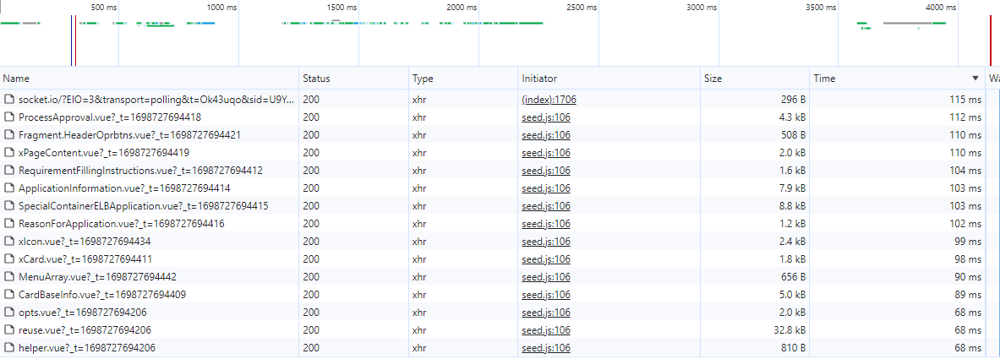

# Boundless

- 无须打包处理，可直接上传服务器，NGINX html代理
- 真正做到按需加载。
  - 纯手工打造，可以精确到一个字符，一个标点号。
  - 主打一个匠心品质（狗头摇晃保命）
- idbkeyval缓存静态资源，只要版本号不更新，只在第一次进入系统的时候加载资源。（根据appversion判断是否需要重新下载资源，window.APP_VERSION为真值即可开启）

> TODO:也可以独立打包，有空实现一个rollup插件

## 跳转插件
- >[boundless-vue-helper](https://marketplace.visualstudio.com/items?itemName=ShoneSingLone.boundless-vue-helper)

## 山寨（zei）王UI

>只要看上了就山寨过来

- [arco.design](https://arco.design/vue/component/resize-box)
- [devui](https://vue-devui.github.io/components/code-editor/)
- [tiny-vue](https://opentiny.design/tiny-vue/zh-CN/os-theme/components/form)

## HMR
-  使用defineComponent定义Vue组件，默认添加NEED_HMR: localStorage.isDev；用于热替换。 
- （目前有多级属性传递问题，尚不稳定。）
- 函数式组件的render是否支持async 异步？
- disabled 、readOnly 状态的控制
    - 控制范围

## 优化

