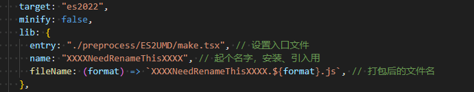

# Boundless

不需要打包的web项目，方便vi直接在服务器打补丁。可支持类似Vue SFC 的.vue单文件，支持less在线编译。配套vscode插件完善中。

- 无须打包处理，可直接上传服务器，NGINX html代理
- 真正做到按需加载。
  - 纯手工打造，可以精确到一个字符，一个标点号。
  - 主打一个匠心品质（狗头摇晃保命）
- idbkeyval缓存静态资源，只要版本号不更新，只在第一次进入系统的时候加载资源。（根据appversion判断是否需要重新下载资源，window.APP_VERSION 为真值即可开启）

> TODO:也可以独立打包，有空实现一个rollup插件

## 跳转插件
- >[boundless-vue-helper](https://marketplace.visualstudio.com/items?itemName=ShoneSingLone.boundless-vue-helper)

## 山寨（zei）王UI

> UI层面的，只要它是开源的，看上了就可以山寨过来。

- [element V2](https://element.eleme.cn/#/zh-CN/component/tabs)
- [arco.design](https://arco.design/vue/component/resize-box)
- [devui](https://vue-devui.github.io/components/code-editor/)
- [tiny-vue](https://opentiny.design/tiny-vue/zh-CN/os-theme/components/form)

### 国际化

```bash
pnpm i18n zhong_liang
```


### demo
- 简单的参考elButton.vue，直接CV
- 复杂点的例如[virtualized-table](https://element-plus.org/zh-CN/component/table-v2.html#virtualized-table-%E8%99%9A%E6%8B%9F%E5%8C%96%E8%A1%A8%E6%A0%BC)
  - 利用 `vite build`
  - 
  - 打包出来再CV调试

## 关键参数

window._CURENT_IS_MOBILE
window.APP_VERSION,
window.APP_ENTRY_NAME 默认entry 其他的也可以

## HMR
-  使用defineComponent定义Vue组件，默认添加NEED_HMR: localStorage.isDev；用于热替换。 
- （目前有多级属性传递问题，尚不稳定。）
- 函数式组件的render是否支持async 异步？
- disabled 、readOnly 状态的控制
    - 控制范围


## 优化


## utils

- git rm -r --cached
- [visualRegex](https://wangwl.net/static/projects/visualRegex#)

## d.ts

- pnpm d.ts rules
- pnpm d.ts api xxx

## TODO


## 参考
[](https://template-explorer.vuejs.org/#eyJzcmMiOiIgIDxlbC1pbnB1dFxyXG4gICAgcGxhY2Vob2xkZXI9XCLor7fpgInmi6nml6XmnJ9cIlxyXG4gICAgdi1tb2RlbD1cImlucHV0M1wiPlxyXG4gICAgPGkgc2xvdD1cInN1ZmZpeFwiIGNsYXNzPVwiZWwtaW5wdXRfX2ljb24gZWwtaWNvbi1kYXRlXCI+PC9pPlxyXG4gIDwvZWwtaW5wdXQ+XHJcbiAgPGVsLWlucHV0XHJcbiAgICBwbGFjZWhvbGRlcj1cIuivt+i+k+WFpeWGheWuuVwiXHJcbiAgICB2LW1vZGVsPVwiaW5wdXQ0XCI+XHJcbiAgICA8aSBzbG90PVwicHJlZml4XCIgY2xhc3M9XCJlbC1pbnB1dF9faWNvbiBlbC1pY29uLXNlYXJjaFwiPjwvaT5cclxuICA8L2VsLWlucHV0PiIsIm9wdGlvbnMiOnt9fQ==)

- [vscode 国际化插件](https://mp.weixin.qq.com/s/-eomr-pofHNodJHbACcuLQ)
- [vtable](https://visactor.io/vtable/demo/edit/pivot-table-editor)

- [husky](https://www.npmjs.com/package/husky)
  - [githooks](https://git-scm.com/docs/githooks)
  - `npx husky add .husky/pre-commit "npm test"`

- [appflowy](https://www.appflowy.io/)
- [LocalSend](https://localsend.org/#/)
- [insomnia](https://github.com/Kong/insomnia)